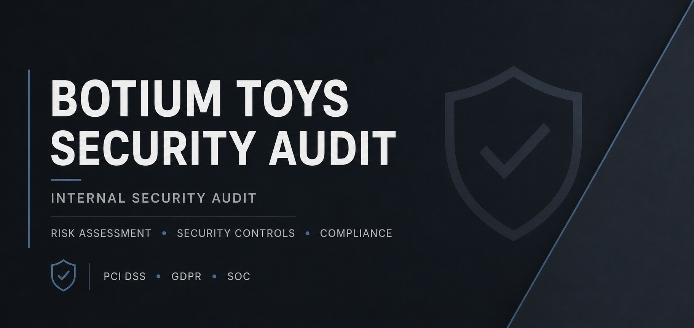

# Auditoria de Segurança - Botium Toys

[English](./README-EN.md) | **Português (PT-BR)**

## Visão Geral

Este projeto é um laboratório acadêmico de cibersegurança baseado na empresa fictícia Botium Toys.

O objetivo foi realizar uma auditoria interna de segurança, analisando os controles de segurança, riscos, ativos e práticas de conformidade da organização.

## Habilidades Aplicadas

- Auditoria de segurança
- Avaliação de riscos
- Avaliação de controles de segurança
- Princípio do menor privilégio
- Separação de funções
- Criptografia de dados
- Backup e recuperação de desastres
- Sistemas de Detecção de Intrusão (IDS)
- PCI DSS
- GDPR
- Controles SOC
- Tríade CIA

## Principais Constatações

A auditoria identificou diversas lacunas de segurança, incluindo:

- Ausência da implementação do princípio do menor privilégio
- Ausência de separação de funções
- Ausência de um Sistema de Detecção de Intrusão (IDS)
- Falta de criptografia para informações sensíveis
- Ausência de backups de dados críticos
- Políticas de senha fracas
- Acesso excessivo a informações sensíveis

A organização também possui alguns controles de segurança já implementados, incluindo proteção por firewall, software antivírus, fechaduras físicas, monitoramento por circuito fechado de televisão (CCTV) e sistemas de detecção e prevenção de incêndio.

## Recomendações

A Botium Toys deve melhorar seus controles de acesso, fortalecer as políticas de senha, implementar criptografia e backups e adicionar um Sistema de Detecção de Intrusão (IDS).

Essas medidas ajudariam a proteger informações sensíveis, reduzir riscos de segurança e melhorar as práticas de conformidade relacionadas ao PCI DSS, GDPR e SOC.

## Documentos do Projeto

### Auditoria de Segurança

- [Auditoria de Segurança - Português (PT-BR)](./Botium_Toys_Security_Audit_PTBR.pdf)
- [Security Audit - English](./Botium_Toys_Security_Audit_EN.pdf)

### Escopo e Avaliação de Riscos

- [Escopo e Avaliação de Riscos - Português](./scope-and-risk-assessment-ptbr.md)
- [Scope and Risk Assessment - English](./scope-and-risk-assessment.md)

## Aviso

Este projeto foi desenvolvido como parte de um ambiente de treinamento em cibersegurança utilizando uma empresa fictícia. Ele não representa uma auditoria de segurança realizada em uma organização real.
